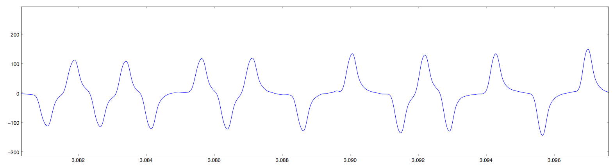
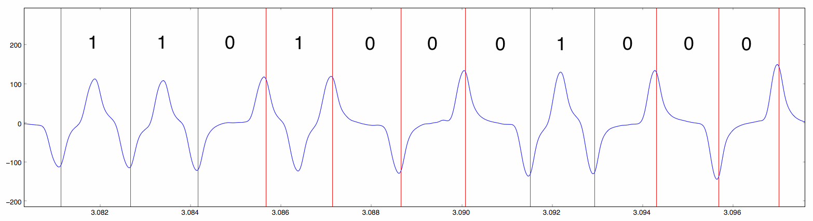
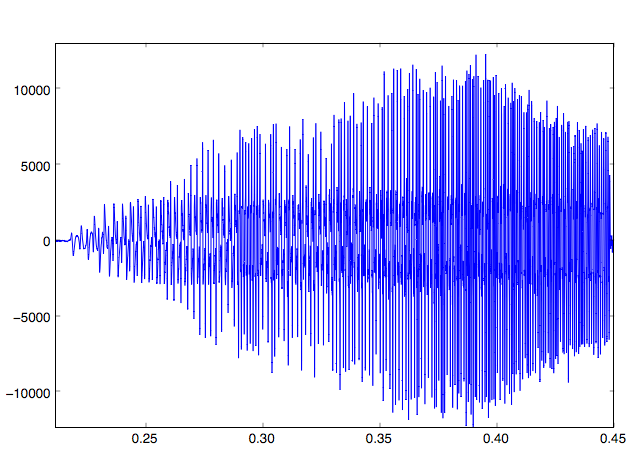
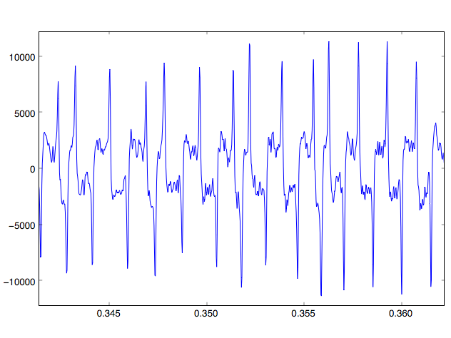
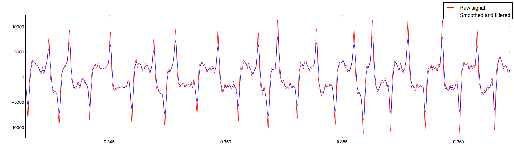
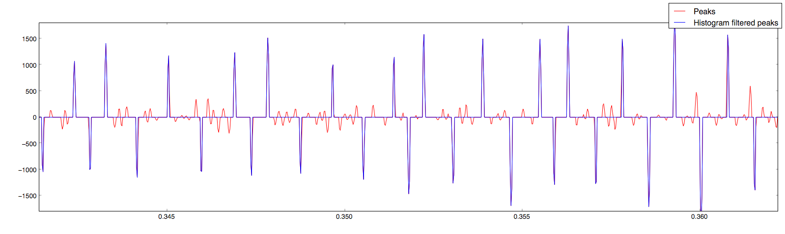

# The Geometry of Innocent Signals on the Wire

#### A security evaluation of <a href='https://squareup.com/'>Square</a> 

### CS 380S Fall 2010 | 0x1A Great Papers in Computer Security

##### Aaron Stacy

## Overview

[Square] is a payment gateway that accepts credit card payments through the headphone jack of a smart phone or tablet device.  This report investigates the security of this system, specifically on the [iOS] platform.  The Square System Components section provides details about the card reader, iOS application, and physical and network infrastructure; the Security section provides a threat model, followed by several possible attack vectors.

This project also includes a sample implementation that demonstrates how a malicious iOS app could skim credit card numbers by either impersonating the Square app or possibly snooping the credit card signal from the audio jack.

## Square System Components

#### Card Reader

###### Overview

The Square card reader is a dongle that plugs into the headphone jack of the device.  They are freely attainable by signing up for an account on the Square website, and likely inexpensive to manufacture.  They are small, about one square inch in size, and require no batteries or power supply.  The signal coming from the reader into the device is analog, and the reader appears to have no digital circuitry.

Immediately the card reader is a security red flag; it is extremely difficult to encrypt an analog signal coming from an unpowered device, so this is a likely attack vector.  Indeed, [VeriFone][verifone_calls_out_square] has criticized Square for this.  Square [initially said][square_wont_encrypt] they had no plans to encrypt their reader, but they have [since announced][square_working_with_visa_reqs] that they will provide an encrypted reader, in accordance with Visa [security guidelines][visa_security_requirements].  The new reader was rumored to be [available the summer of 2011][square_encrypted_reader], but the reader used for this project, which was received October 1st, 2011, was found not to be encrypted.

###### The Card Reader Signal

Getting information from the card reader requires converting the analog signal to digital, and then decoding the bits.  The analog signal uses [biphase mark coding][bmc_encoding] (BMC) to transmit either a 1 or a 0 based on the number of polarity transitions in each clock period.  1's are encoded by transitioning twice in one clock period, while 0's only transition once.

_Figure 1: Smooth, clean biphase mark coding (BMC) signal_

Figure 1 shows a clean BMC encoded signal.  Figure 2 shows the same signal with the clock signal overlayed and the periods marked correspondingly as either 1 or 0.  As the figure shows, when the signal changes phase (from high-to-low or low-to-high) once in a transition, it is interpreted as a 0, and when the signal changes twice, it is interpreted as 1.

_Figure 2: BMC signal annotated with clock signal and digits_

While the plots above suggest this is a straitforward process, experimentally it is more difficult since (a) the clock signal must be derived from the raw signal,  and (b) there is a significant amount of noise as shown in Figures 3a and 3b.

Figure 3: Full, noisy BMC signal (left), and close-up (right)
 

The quality of the signal can vary significantly between cards, and the steps involved in processing vary depending on the level of noise.  The first step in extracting the bits from a poor signal is to smooth it with convolution and pass it through a median filter (Figure 4).

_Figure 4: Raw signal plotted with convolution-smoothed and median-filtered signal_

One may notice the gaps between the peaks of the raw signal and those of the smoothed and filtered.  These differences provide a fairly robust way of picking out transitions from low to high, since simply picking local maxima would yield many false positive transitions, even the from the smoothed signal.  

However there is still a significant amount of noise when plotting the difference between the curves in Figure 4 (Figure 5, red signal).  When looking at only a small window of the signal, it would appear that one could just set a threshold, and any peak whose absolute value was below the threshold would be zeroed.  This is once again insufficiently robust, since the signal drastically changes magnitude (Figure 3a).  This next step used what this report will call a "histogram threshold filter".  This filter rolls through the signal, considering just a window in which the magnitude does not drastically change, but still includes around 5-10 periods of the waveform.  A histogram of the absolute values of the magnitudes in this window is plotted.  This histogram tends to take a backwards 'J' shape, where there are many samples with relatively small magnitudes, and the number of samples increases slightly at the top of the histogram, corresponding to the peaks where transitions happen.  The cutoff threshold is set at the local minimum of this 'J' shape, and all samples below the cutoff are zeroed.  The resulting signal is shown in the blue signal of Figure 5.

_Figure 5: Signal peaks and histogram filtered peaks_

At this point the reader should begin to notice how the peaks can be used to programatically find 1's and 0's from the analog signal.  There is one last catch though; the period of the signal decreases by about half over the course of the card swipe.  The initial approach was to calculate the peak frequency for a rolling window of the signal, and use this to find transitions.  This proved to be error prone, though, since the waveform period sometimes changes by up to 25% from one bit to the next.  As a result the algorithm used was a simpler, more straitforward approach of simply tracking the average period of the last 5 bits, and using that to estimate the location of the next.  This proved to be sufficiently robust and accurate.

Once the signal was digitized, extracting the credit card numbers was as simple as following the [ISO 7813] guidlines for decoding Track 1 of magnetic card stripes (well summarized [here][magtek_card_standards]).  Initially, due to inconsistencies in digitizing and the rumors mentioned above, the author believed the signal might be encrypted.  As a result, several attempts were made to find patterns between signals by `XOR`ing them with the expected output, in hopes of finding a common key.  However, after refining the digitizing process, it became clear that the card reader does not encrypt the signal.

#### iOS Application

Square's iOS application is [PCI DSS-1 compliant][square_security], which has a couple important implications:

- **Data stored on the device must be encrypted** ([requirement 3][pci]): This requirement could likely accomplished with [Apple's iOS Keychain API][keychain], however Square claims to [store no magnetic stripe data][square_security].

- **Data transmitted over public networks must be encrypted** ([requirement 4][pci]): This requirement appears to be accomplished with SSL.  Vulnerabilities in SSL and certificate authorities encompass a broad subject that is out of scope for this project, so this aspect of the Square system was not investigated any further.

However there are facets of the device that are not addressed in the PCI standard, specifically the standard does not place constriants on data traveling from the reader to the application, aside from the very general sixth requirement, to "develop and maintain secure systems and applications".

Due to the sandboxed, restricted nature of iOS apps, it is generally difficult for one app to snoop the state of another.  For example, there is no public API for sharing files between apps, only [providing custom URL schemes][ios_url_api].  However shared resources such as the microphone present an interesting opportunity.  Apple does not provide official documentation about sharing audio in apps.  Official documentation on [audio in background apps][official_background_audio] is terse at best, and the implementation is [quirky and brittle][experimental_background_audio].

This project found that while a foreground app is recording audio, it is possible for a background app to be doing so as well, without any notification to the user, though a user would have had to open the background app in the first place.  This project also found no means of gaining exlusive access to the microphone, or alternatively preventing other apps from listening, except possibly trying to expend enough memory to force other apps to close.  With this in mind, it could be possible for a user to swipe their card in to make a payment with the Square app in the foreground while a malicious app is listening to the swipe in the background.

The background app attack is demonstrated in this project's implementation against sample apps, however this is only in the iOS Simulator.  Since there were no Apple Developer Connection accounts available for this project, the attack could not be attempted on real hardware against the actual Square iOS app.

#### Physical and Network Infrastructure

Square's back-end card processing systems are also [PCI DSS-1 compliant][square_security].  This is also a layer of the stack that has broad security implications that are out of scope of this project, so no vulnerabilities were investigated.

## Square Security

#### Threat Model

The threat model for this project is a malicious app that the user might download from Apple's iTunes Store.  The app has access to all of the standard API's, but the app's behavior is "normal" (no stack smashing, no buffer overflow exploits, etc.), so the app could masquerade as a game or possibly social networking client.

A more stringent threat model is also discussed, in which the attacker has physical access to the device, for instance if they are an employee at a small vendor that uses Square for payment processing.  In this model the attacker may be able to download malicious apps directly to the phone, circumventing the iTunes Store.

#### Attack Vectors

###### Phishing

The first attack vector is the one [proposed by VeriFone][verifone_calls_out_square], which is basically just phishing.  The attacker produces a clone of the Square app, and deceives the user into installing and running it.  While this attack is certainly possible and seems plausible on the surface since there is no encryption between the card reader and the device, in practice it is quite unlikely.  Some of the hurdles include:

- Getting into the iTunes store: Apple reviews every app before it gets into the iTunes store.  A clone of an app as high-profile as Square would be easily noticed and difficult to pass off as legitimate.

- Making payments: Vendors will notice quickly that payments are not being processed, so even if a malicious app did make its way on the device, its impact would be severly limited.

- Square app design: Much like the visual queues on a dollar bill, the Square app design is very detailed and difficult to forge.  Phishing attacks would have to assume that the user is not familiar with the app's user interface.

Given the above hurdles, only the second, more stringent threat model is valid.  This threat model is very difficult to prevent, and in fact is no different than situations where buyers give their credit card to a malicious bartender or restaurant server.

###### Electronic Skimming

In the second vector, the attacker attatches an electronic skimming device to the phone.  This could possibly be disguised as a case for the device, but somehow tap into the headphone jack.

Once again, this attack is entirely possible since the signal coming from the reader is not encrypted, and it is made easier by the fact that the [microphone contact is closest to the top of the recepticle][pinout], however the likelihood is limited.  This attack requires the more stringent threat model which, for the same reasons stated above, is not likely.

###### Snooping

The most plausible attack vector is snooping, which appears possible with either threat model.  In this attack, an app which is malicious but appears legitimate is submitted to the iTunes store.  Since it ostensibly does not perform illegal actions and is masquerading as a useful app, it may be downloaded by users of Square.  The user would open the malicious app, and, unknown to the user, the app would start a background process and begin recording audio. When the user brings the Square app to the foreground and processes a payment, the malicious app will record the audio of the credit card swipe and post that to a malicious server for processing.

Once again, this cannot be officially verified without an Apple Developer Connection account, but implementation of this project suggests that it is possible.

## Project Deliverables

Below are concise summaries of what this project found for each of its deliverables.

> Determine if it is it possible for two different iOS apps to listen to the microphone (the input for the Square device) at the same time

It is possible.

> Provide an implementation demonstrating two apps inputting from the microphone at the same time

To verify, compile the 'Crooked' and 'SpeakHere' apps provided in the project implementation in XCode.  Launch the Crooked app and start recording.  Switch to the SpeakHere app and record a short sound byte.  Switch back to the Crooked app and stop the recording and listen to verify that it continued recording in the background.

> Determine if is it possible for an app to gain exclusive listening privileges to to the microphone

It does not appear to be possible.  The project found no evidence of this capability in the official documentation or elsewhere online.

> Determine whether it is possible for a background app to snoop the input from the Square app

This appears to be possible, however without an Apple Developer Connection account, this is only based on interacting with a dummy app (SpeakHere).

> Provide an implementation demonstrating whether or not this is possible

To verify, start the processing server from the base of the project directory:

    $ ./server.py

Follow the steps above, but connect the Square card reader device and record the swiping of the card.

Note that you must correctly specify the hostname of the machine running `server.py` in the Crooked app.  Also, in order to capture audio from the microphone line-in into the iOS Simulator on a Mac laptop, you must also connect something to the audio line out.

> If one app is capable of gaining exclusive access to the audio device, this may be another DoS attack vector

This does not appear to be possible

> Determine if it would be possible to instrument a "device-in-the-middle" attack on the square device

This is possible, and is described as an attack vector in the 'Electronic Skimming' section above.

> Provide a software implementation that demonstrates whether this is possible

This is verified in the steps above.

> Provide a substantial document reviewing the architecture of the payment system, with a special focus on the Square card reader and the iOS system

This report serves as the document.

[Square]: https://squareup.com/
[iOS]: http://www.apple.com/ios/
[verifone_calls_out_square]: http://www.sq-skim.com/
[visa_backs_square]: http://www.reuters.com/article/2011/04/27/us-visa-mobile-idUSTRE73Q5TZ20110427
[square_working_with_visa_reqs]: http://www.visasecuritysummit.com/blog/?p=73&sms_ss=email&at_xt=4db9d989653130ad%2C0
[visa_security_requirements]: http://investor.visa.com/phoenix.zhtml?c=215693&p=irol-newsArticle&ID=1555291&highlight=
[square_wont_encrypt]: http://techcrunch.com/2011/03/09/squares-jack-dorsey-verifones-security-hole-allegation-is-not-a-fair-or-accurate-claim/
[square_encrypted_reader]: http://storefrontbacktalk.com/securityfraud/square-reverses-course-now-embraces-encryption/
[square_security]: https://squareup.com/security/levels
[pci]: https://www.pcisecuritystandards.org/documents/pci_dss_v2.pdf
[keychain]: http://developer.apple.com/library/mac/documentation/security/Conceptual/Security_Overview/Architecture/Architecture.html#//apple_ref/doc/uid/TP30000976-CH202-SW9
[ios_url_api]: http://developer.apple.com/library/ios/documentation/iPhone/Conceptual/iPhoneOSProgrammingGuide/AdvancedAppTricks/AdvancedAppTricks.html#//apple_ref/doc/uid/TP40007072-CH7-SW18
[official_background_audio]: http://developer.apple.com/library/ios/documentation/iphone/conceptual/iphoneosprogrammingguide/ManagingYourApplicationsFlow/ManagingYourApplicationsFlow.html#//apple_ref/doc/uid/TP40007072-CH4-SW20
[experimental_background_audio]: http://cocoawithlove.com/2011/04/background-audio-through-ios-movie.html
[pinout]: http://pinouts.ru/HeadsetsHeadphones/iphone_headphone_pinout.shtml
[magtek_card_standards]: http://stripesnoop.sourceforge.net/devel/layoutstd.pdf
[bmc_encoding]: http://en.wikipedia.org/wiki/Biphase_mark_code
[ISO 7813]: http://www.iso.org/iso/iso_catalogue/catalogue_tc/catalogue_detail.htm?csnumber=43317